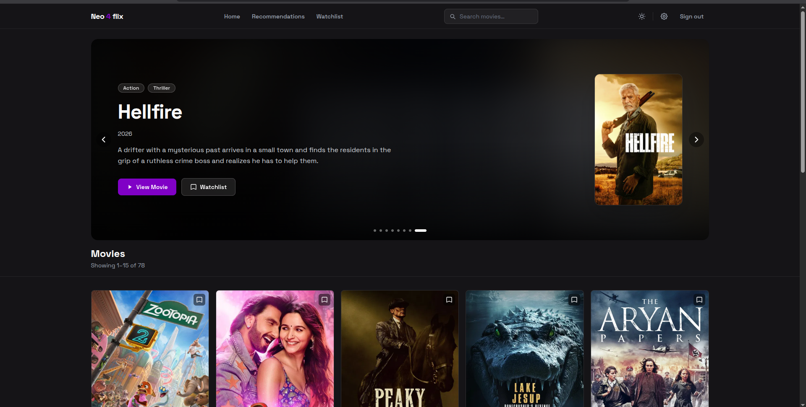

# Neo4flix Frontend

Angular 21 frontend for the Neo4flix movie recommendation platform. Communicates with a Spring Boot microservices backend through an API gateway.



## Key Features

- **Movie Discovery**: Paginated grid of movies with high-quality posters and metadata.
- **Advanced Search**: Filter movies by title, genre, and release year range with real-time URL synchronization.
- **Interactive Ratings**: 5-star rating system with instant feedback (create, update, or delete your ratings).
- **Secure Authentication**: JWT-based auth with Login and Registration (rendered as modal overlays).
- **Two-Factor Authentication (2FA)**: Support for TOTP (Google Authenticator, etc.) for enhanced account security.
- **Optimized Images**: LQIP (Low Quality Image Placeholder) blur-up effect for smooth poster loading.
- **Dark/Light Mode**: Full theme support with a dedicated toggle.
- **Responsive Design**: Mobile-first UI built with Tailwind CSS v4.
- **Server-Side Rendering (SSR)**: Improved SEO and initial load performance using Angular SSR.

## Tech Stack

- **Framework**: [Angular 21](https://angular.dev/) (Standalone Components, Signals)
- **Styling**: [Tailwind CSS v4](https://tailwindcss.com/)
- **State Management**: [Angular Signals](https://angular.dev/guide/signals) for reactive, fine-grained state.
- **Rendering**: Angular SSR + Express 5.
- **API Communication**: `HttpClient` with functional interceptors for base URL prepending and JWT injection.
- **2FA**: `qrcode` for generating TOTP setup codes.

## Prerequisites

- Node.js 20+
- npm 10+
- Angular CLI 21: `npm install -g @angular/cli`
- The backend services running (see backend README)

## Clone & Install

```bash
git clone https://github.com/johneliud/neo4flix-frontend
cd neo4flix-frontend
npm install
```

## Development Server

```bash
ng serve
```

Opens at `http://localhost:4200`. The app proxies all `/api/*` requests to the API gateway at `http://localhost:8081`.

## Project Structure

- `src/app/core`: Singleton services, guards, and interceptors.
- `src/app/features`: Domain-specific feature modules (auth, movies, search, settings).
- `src/app/shared`: Reusable UI components (rating, lazy-image, pagination, etc.).
- `src/app/layouts`: Shell layouts (MainLayout with header).

## Build

```bash
ng build
```

Output goes to `dist/neo4flix-frontend`. The production build uses relative URLs — the reverse proxy handles routing to backend services.

## Running Tests

```bash
# Unit tests
ng test

# End-to-end tests
ng e2e
```

## Environment

The app uses `src/environments/` to configure the API base URL:

| File | `apiUrl` | Used for |
|------|----------|----------|
| `environment.ts` | `http://localhost:8081` | Local development |
| `environment.production.ts` | `''` (relative) | Production build |

No `.env` file is needed for the frontend. All secrets are on the backend.

## Backend

The full backend stack (API gateway + microservices + Neo4j + PostgreSQL) is started with:

```bash
cd ../          # repo root
./start-services.sh
```

This opens individual terminal windows for Docker Compose and each Spring Boot service.

## Documentation

- [`docs/ARCHITECTURE.md`](docs/ARCHITECTURE.md) — project structure, services, routing, components, design system
- [`guide/ISSUES.md`](guide/ISSUES.md) — milestone progress tracker
